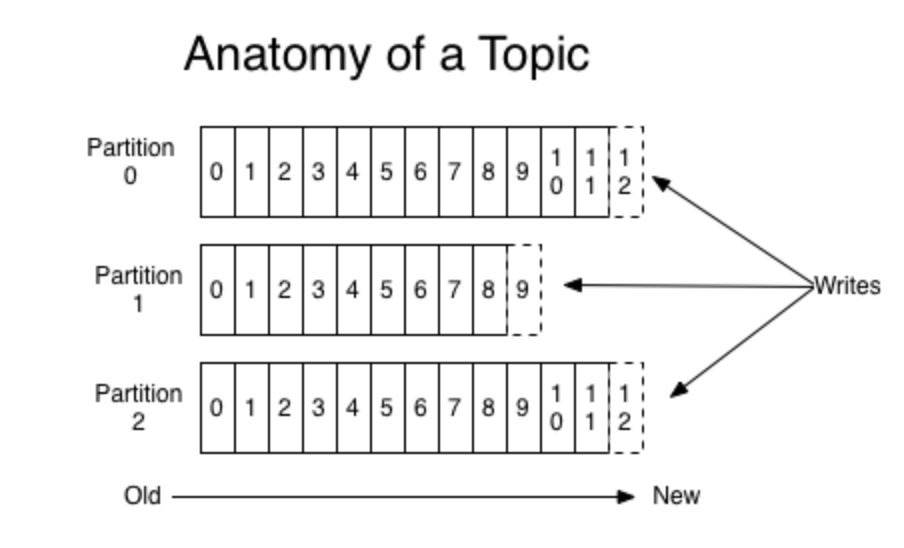

# php-kafka

An opinionated Kafka producer & consumer library for PHP.

## Dependencies
 
 - PHP 7.x 
 - [librdkafka](https://github.com/edenhill/librdkafka) ([Installation instructions](https://arnaud.le-blanc.net/php-rdkafka/phpdoc/rdkafka.installation.html))
 
 ## About
 
 > This documentation refers to our Producers & Consumers, not necessarily Kafka Producers and Consumers in general.
 
 This project provides a convenient way to Producer and Consume Avro-encoded records for Kafka. It uses Confluent's
 schema registry and (php-rdkafka)[https://github.com/arnaud-lb/php-rdkafka]. 
 

### Core Kafka Concepts

Kafka stores records in a fast, highly-available cluster. The records are organized into topics, much like
how the data of a relational database is organized using tables. The major difference being that a Kafka topic
is an append-only commit log ([a good article about logs](https://engineering.linkedin.com/distributed-systems/log-what-every-software-engineer-should-know-about-real-time-datas-unifying))
instead of a mutable data store. Records are sent to Kafka using a `Producer`, and records are read from Kafka using a `Consumer`.

Each topic can have one or more partitions. Partitioning a topics allow for the concurrent processing of records in that
topic. Each topic also has a "replication factor" which is the number of copies of the topic that exist.

Each record in Kafka is assigned an offset. Each record in a partition of a topic gets a unique identifier. In this image
the vertical numbers are the record offsets:



This project mandates the use of [Schema Registry](https://docs.confluent.io/current/schema-registry/index.html) to
store/retrieve/validate the schemas of the data being sent to Kafka.

### Producing

Create a producer using the `ProducerBuilder` class. There are many configuration options available, but the
defaults are a good starting point. An important method on the builder class is `setSslData`. Use this to
set the location of the certificate and keys if necessary.

```php
$builder = new ProducerBuilder(['brokers.go.here:123'], 'http://schemaRegitry.url');
$producer = $builder->setSslData('ca.pem', 'service.cert', 'service.key')->build();
```

Producers emit messages to kafka. These messages are an avro-encoded record of whatever data you want to send.
The Producers only understand data that is in the form of a class that extends `BaseRecord`.

```php
<?php
use EventsPhp\BaseRecord;
use App\Producer\ProducerBuilder;

class Duck extends BaseRecord {
    private $id;

    public function setId($id): void
    {
        $this->id = $id;
    }

    public function getId(): int
    {
        return $this->id;
    }

    public function schema(): string
    {
        return <<<SCHEMA
{
    "type": "record",
    "name": "{$this->name()}",
    "namespace": "pond",
    "fields": [{ "name": "id", "type": "int" }]
}
SCHEMA;
    }

    public function jsonSerialize()
    {
        return [
          'id' => $this->encode($this->id),
        ];
    } 
}

$producer = (new ProducerBuilder(['brokers.go.here:123'], 'http://schemaRegitry.url'))->build();
$producer->produce(new Duck());
```

The `produce` function doesn't return anything. To get information about the produced record, add a delivery report callback.

```php
    $builder = (new ProducerBuilder($brokers, $schemaRegistryUrl))
        ->setDeliveryReportCallback(function (RdKafka\RdKafka $kafka, Message $message)
            {
                print "The offset of the produced message is " . $message->offset . PHP_EOL;
            });
```


#### Topics

As mentioned above, Kafka organized records into topics similar to how a relational database stored data in tables.
By default, the topic name is the kebab-case class name of the record being produced. This can be changed by sending
an optional second parameter to the `produce` method.

```php
// This will produce to the topic 'duck'
$producer->produce(new Duck());

// This will produce to the topic 'pond-population'
$producer->produce(new Duck(), 'pond-population');
```

#### Failures

If there is an error when trying to produce a record, the data is captured in a `Failure` record and written to a
special failure topic: `fail-kebab-case-record-name`. Writing to the failure topic can be disabled, and the number of
retries is also configurable.

#### Guarantees

The default settings of the Producer give an exactly once delivery guarantee (this is done by setting `enable.idempotence`
to `true`). Kafka also guarantees that messages sent by a producer to a particular topic partition will be stored in the same
order they were sent. Note that this guarantee is on a per partition basis, not per topic.

Kafka also guarantees that a topic will tolerate N-1 server failures if the topic has a replication factor of N.

[Read more about Kafka Guarantees here](https://kafka.apache.org/documentation/#intro_guarantees).

#### Examples

See `/App/Examples/ProducerExample.php` for a working example with comments.

### Consuming

Consumers read records from Kafka. Again, just using the default config options is a good way to start.

Each consumer has a settable group id. Multiple consumers with the same group id can work together to read from a topic
concurrently. Each consumer in a group will automatically be assigned to one or more partitions of a topic. If more consumers are
in a group than there are partitions for a topic, then the unused consumers will sit idle.

Create consumers using the `ConsumerBuilder` class.

```php
$consumer = (new ConsumerBuilder(['brokers.go.here:123'], 'doc-group', 'http://schemaRegitry.url'))->build();
```

#### Topics & Subscriptions

Consumers have a `subscribe` method that take a record class name and a callback. Once the consumer has subscribed to the record,
the `consume()` method is called to start the actual consumption. By default, the consumer will
consume from topics that correspond to the kebab-case name of the type of records it is subscribed to. Here is an
example for clarity:

```php
$consumer = (new ConsumerBuilder(['brokers.go.here:123'], 'doc-group', 'http://schemaRegitry.url'))->build();

$consumer->subscribe(Duck::class, function (Duck $duck) { var_dump($duck); });
$consumer->subscribe(CanadaGoose::class, function (CanadaGoose $goose) { var_dump($goose); });

// This will subscribe to topics 'duck' and 'canada-goose'
$consumer->consume();

// If you want to consume to different topics then send an array of strings to consume
$consumer->consume(['this-topic', 'that-topic', 'my-topic']);
```

#### Failures & Retries

Imagine you consume 100 records from Kafka and save them to a database. When trying to save the 50th records there is an
intermittent database failure and your call to `$someDao->save()` throws an error. To keep track of that failure
the records is written to a failure topic with the format `fail-groupId-the-record-class-name`. Unlike producers which use
a special `FailedRecord` record, records that cause en error when being consumed will be put onthe topic using their original schemas.

```php
$consumer = (new ConsumerBuilder(['brokers.go.here:123'], 'group123', 'http://schemaRegitry.url'))->build();
$consumer->subscribe(Duck::class, function (Duck $record) use ($dao) {
    $dao->save($record); // Assume this throws an error
});
$consumer->consume();

// This records will be written to a topic called fail-group123-duck.
```

#### Read from beginning vs end

It is possible to specify if a consumer consumes from the beginning of a topic or if it only consumes records produced
after it has connected to Kafka. This is on a per topic, per consumer group basis.

Example:
Imagine you have a topic with 100 records. Then you create two consumers.

Consumer 1

-   In consumer group 'one'
-   Uses the default of consuming a topic from the beginning

Consumer 2

-   In consumer group 'two'
-   Consumes a topic from the end.

Both consumers start consuming your topic. Consumer 1 will consume 100 records, consumer 2 will consume 0 records. If
both consumers stay connected to Kafka and 10 new records come in then both will consume those new records. Suppose
instead that you disconnect both consumers before the 10 new records arrive. You wait a while and start to consume
from Kafka again. Consumer 1 will read records with offsets 100 - 110. Consumer 2 will still read nothing. It doesn't
remember that the 'old end' was at offset 100, it just goes to the current end of offset 110.

Currently the only options are to consumer from the beginning or end. It is possible to start consuming from any offset,
but that feature will not be added to this library for the time being.

#### Examples

See `/App/Examples/ConsumeExample.php` for a working example with comments.

### Useful Documentation

-   [rdkafka configuration options](https://github.com/edenhill/librdkafka/blob/master/CONFIGURATION.md)
-   [php-rdkafka repo](https://github.com/arnaud-lb/php-rdkafka)
